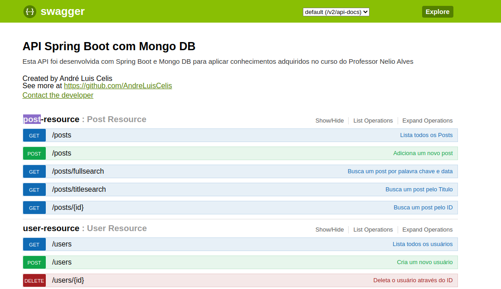

# Api-Spring-Mongodb

Este projeto foi desenvolvido utilizando o framework SpringBoot , para disponibilizar uma API de posts , onde é possivel , adicionar novos posts , assim como adicionar e excluir usuários , e demais operações CRUD

A aplicação foi publicada no heroku , e leva alguns segundos para ser startada no primeiro acesso , foi utilizado o banco de dados mongodb , o servidor do banco de dados é o ATLAS mongodb , a aplicação hospedada no Heroku se comunica com o banco de dados no servidor Atlas e assim disponibiliza os recursos e realiza as operações .

Foi utilizado o Swagger para documentar a API , e através do swagger é possivel fazer uso e testar os endpoint disponiveis na API .

## Deploy da Aplicação :dash:
> <a href="https://celisapp-workshop-mongodb.herokuapp.com/swagger-ui.html?target=_blank" target="-blank">Link do deploy da aplicação:</a>
> [link](https://celisapp-workshop-mongodb.herokuapp.com/swagger-ui.html?target=_blank)

## Tecnologias

- __Spring Boot__ 
- __Mongodb__  
- __Swagger__  
- __Heroku__ 
- __Git__ 

----------------------------------------

------------------------------------------

